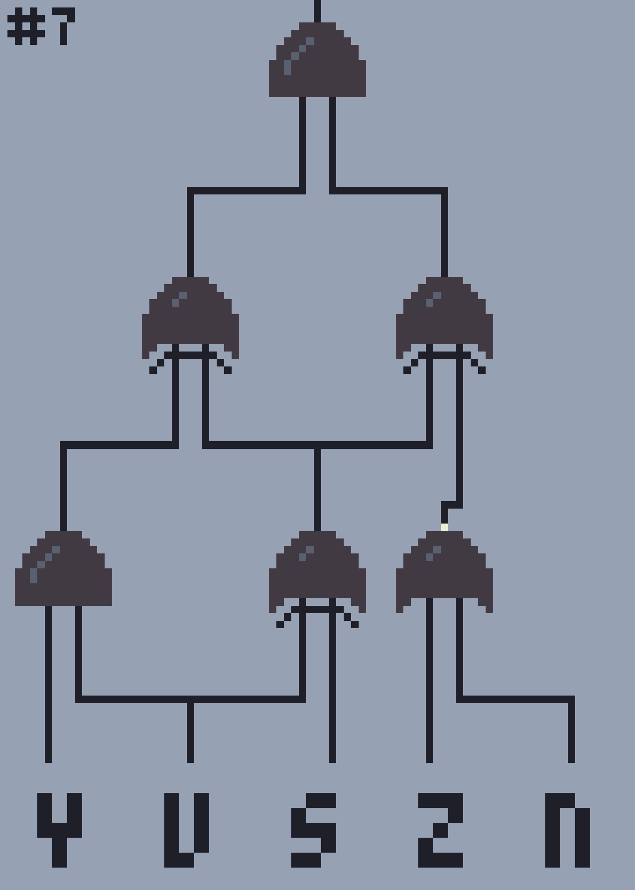

# Logic Gates Generator

### Matteo Golin

[](https://opensource.org/licenses/MIT)

The Logic Gates generator is a command line program that makes use of Python to generate logic gate schematics of
(theoretically) any size, along with their Karnaugh map.



```console
Left side inputs: y, u, s
Top side inputs: z, n

#   00  10  11  01
000 0   0   0   0
100 0   0   0   0
110 0   0   0   0
010 0   1   1   1
011 0   0   0   0
111 1   0   0   0
101 0   1   1   1
001 0   1   1   1
```

## Usage

In order to view the specific command line commands, please run the program by typing
`py main.py -h`

### Program Parameters

In order to run effectively, the program requires the following paramters:

- A filename
- The number of random schematics to be produced (versions)

The program can also take the following parameters, but sets a default value for each.

- Number of inputs (uses the maximum available amount, currently up to 26 have assets)
- Scalar (the factor by which the image produced will be scaled)
- Clear (if set to true, the output folder will be emptied before the program runs)

## Outputs

The program will produce the schematics as PNG images, which by default are unscaled. Karnaugh maps will be created as
text files.

**Example 4 input Karnaugh Map:**

```
Left side inputs: a, b
Top side inputs: c, d

#  00 10 11 01
00 1  1  1  1
10 1  1  0  1
11 1  1  1  1
01 1  1  0  1
```

By default, assets are 17x17 pixels, so the size of the image will depend on the number of inputs added. The width is
equal to the number of inputs multiplied by 17, and the height is equal to the number of bits in the binary
representation of the number of inputs, multiplied by 2, plus one (and of course multiplied by 17 pixels).

```
FORMULA:
n = number of inputs
width = n * 12
height = (2 * length(binary(n)) + 1) * 17

EXAMPLE:
n = 10
width = 10 * 17
height = (2 * length(binary(10)) + 1) * 17

binary(10) = 1010
length(binary(10)) = 4
height = (2 * 4 + 1) * 17
```

Outputted image size can be controlled by the scalar value, which will be multiplied by the width and height of the image
to enlarge it.

## Installation

Python 3.10.0 or later must be installed. This software makes use of the following modules:

- Numpy
- Progress
- PIL
- Random

## For Reviewers

The following functions could be optimized, and get quite slow when handling schematics that have large numbers of inputs:

### All functions pertaining to output trees:

- output_tree
- grid_output_trees
- evaluate_tree
- populate_map

- I have looked into graph theory to success, and also into tail recursion, but I am not sure how to implement it for this
  purpose. Looking into these areas might be helpful?

### The process for generating input combinations _in order_ for Karnaugh maps:

- generate_index

The best process I could find for generating these in order requires brute forcing possible steps. Its slightly
algorithmic and faster than path theory, but it's far from perfect.
